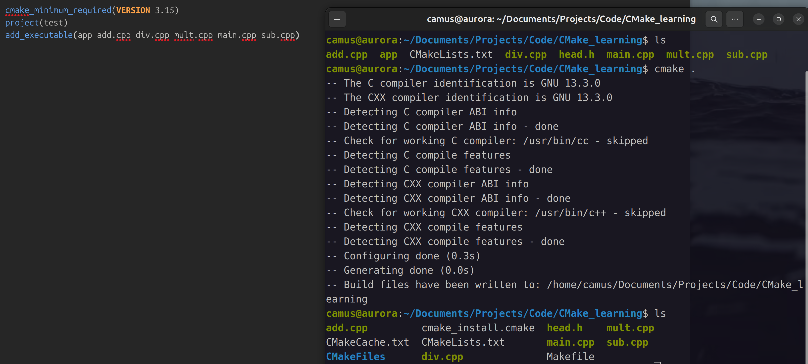
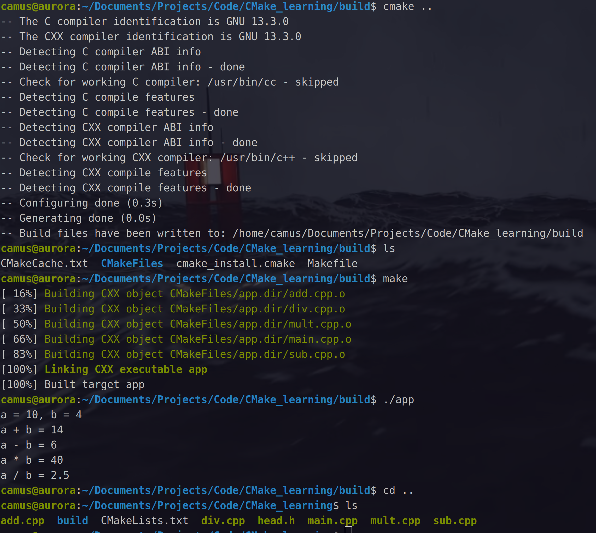

# 1. CMake的作用

<!-- 自己查查 -->

是一个跨平台的自动化构建系统

通过使用CMakeLists.txt配置文件来指导项目的编译、测试和打包过程，并能生成适用于不同操作系统的本地构建系统文件，从而实现软件的跨平台操作

源文件（.c .cpp）---^编译器^[^1]---> 可执行程序

- makefile与cmake
- 库包含静态与动态


## 1.**主要作用**

- 自动化构建流程：简化从编写源代码到生成可执行文件的复杂流程
- 跨平台生成：可生成linux、windows、macOS等平台的相应构建文件
- 简化配置：不同平台只需要这一份配置文件即可
- 构建系统生成器：本身不是构建工具（E.g. make），而是生成构建工具所需的文件

## 2.**工作原理**

- 编写配置文件：CMakeList.txt文件，用简单的语法描述项目结构、模块依赖关系等
- 运行CMake命令：使用Cmake命令读取CmakeLst.txt
- 生成构建文件
- 执行构建

---

# 2. 编写一个CMakeLists.txt文件

示例为五个文件

```
main.cpp
add.cpp
sub.cpp
mult.cpp
div.cpp
head.h
```


## 2.1: 安装Cmake

```bash
# ubuntu
sudo apt install cmake

# arch linux
sudo Pac-Man -S cmake
```

## 2.2 相关指令

### 1. 注释

- 注释行，使用`#`符号

```txt
# 这是一个CMakeLists.txt的注释行
```

- 注释块，使用`#[[]]`

```txt
#[[这是一个CMakeLists.txt的注释块
这是第二行注释
这是第三行注释]]
```

### 2. `cmake_minimum_required`

- 用于指定**使用的cmake的最低版本**
- 可选，非必需，==但是不加可能会存在警告==

### 3. `project`

- 定义工程名称，可指定工程的版本、工程描述、web主页地址、支持的语言（*默认支持所有语言*），需指出==工程名字==

```txt
# PROJECT语法
project(<PROJECT-NAME> [<language-name>...])

or

project(<PROJECT-NAME
	[VERSION <major>[.<minor>[.<patch>[.<tweak>]]]]
	[DESCRIPTION <project-description-string>]
	[HOMEPAGE_URL <url-string>]
	[LANGUAGE <language-name>...])
```

### 4. `add_executable`

- 定义工程会生成一个可执行程序
    - 这里的的可执行程序名与`project`中的并没有关系
    - 源文件可以是一个也可以是多个，**多个需要使用`;`或者空格分开**

```txt
add_executable(可执行程序名 源文件名称)
```

# 3. 执行CMake命令

```bash
cmake CMakeLists.txt文件所在路径
```





[^1]: 一套工具链，所谓tool chain，包含==**预处理、编译、汇编、链接**==四个步骤

